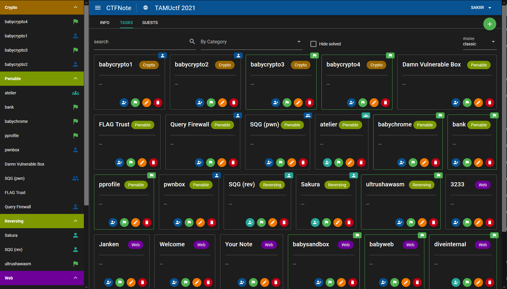
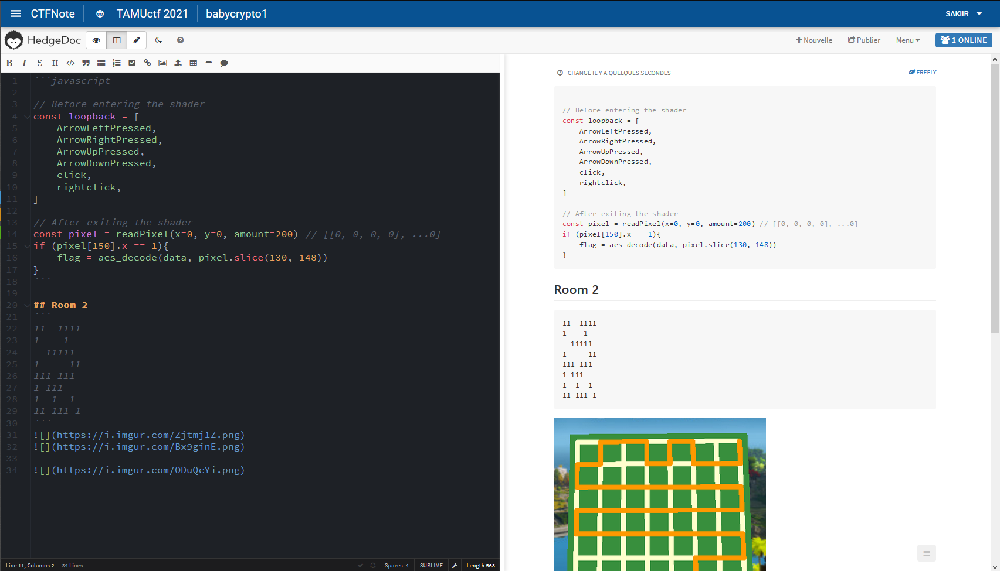

<p align="center">
  
</p>

# CTFNote

## Welcome

CTFNote is a collaborative tool aiming to help CTF teams to organise their work.






## Installation

You have to clone the repository and initialize the submodules, since CTFNote uses [DestructiveFarm](https://github.com/DestructiveVoice/DestructiveFarm) to make Attack/Defense CTF infrastructure possible:

```
git clone https://github.com/JJ-8/CTFNote
git submodule init
git submodule update
```

Then, copy `.env.example` to `.env` in the root of the project and fill in the configuration.

Then, use the provided docker configuration to deploy the project:

```shell
$ docker-compose up -d
```

Then, visit 127.0.0.1 and create your first account, which will automatically be provided with admin privileges.

Please note that CTFNote is only available from `127.0.0.1:8080`. Please use nginx to make it available over HTTPS.

### nginx

It is assumed that you want to serve CTFNote over HTTPS. HTTP configuration is not supported.

An example configuration for `nginx` on the host looks like this:

```
server {
        server_name ctfnote.my.domain;

        root /var/www/html;
        index index.html;

        location / {
                proxy_pass http://127.0.0.1:8080/;
                proxy_http_version 1.1;
                proxy_set_header Upgrade $http_upgrade;
                proxy_set_header Connection $http_connection;
                proxy_set_header Host $http_host;
                proxy_set_header X-Real-IP $remote_addr;
                proxy_set_header X-Forwarded-For $proxy_add_x_forwarded_for;
                proxy_set_header X-Forwarded-Proto $scheme;
                add_header Pragma "no-cache";
        }
}
```

After deploying this configuration, run `certbot` to make it available over HTTPS. See [this article](https://www.digitalocean.com/community/tutorials/how-to-secure-nginx-with-let-s-encrypt-on-ubuntu-20-04) for more information.

### DestructiveFarm

> Exploit farm for attack-defense CTF competitions

CTFNote includes a fork of a fork of [DesctructiveFarm](https://github.com/JJ-8/DestructiveFarm). This instance can be accessed via `https://your.domain.com/desctructivefarm/` and use the `DESCTRUCTIVE_FARM_PASSWORD` specified in the .env file as username and password.

You can change the configuration of DestructiveFarm by directly editing `./DestructiveFarm/server/config.py`. The changes will be reflected immediately.

## Privileges

We use a cascade privilege system. That means ADMIN users have all the rights MANAGER users have and MANAGER have all the rights MEMBER users have and so on.

- ADMIN: Can create and manage CTFs, as well as managing the instance ( managing users and configuration of the platform ).
- MANAGER: Can edit CTFs information and invite guests into a specific CTFs.
- MEMBER: A member represents a standard CTF player from your team, can access all CTFs of the platform by default
- GUEST: no privileges: can only view CTFs when invited; this is used for irregular guests ( ponctually invited user ). GUESTs are allowed to create and edit tasks, but not the CTF information.

## Security

cf. [SECURITY.md](./SECURITY.md)

## Development

The development server includes a simple HTTP proxy allowing the frontend to access the local graphql API (cf [quasar.conf.js](front/quasar.conf.js)).
Hot reloading is configured on both components as well.

First of all, run the following command to run the required services **hedgedoc** and **postgresql**:

### Start hedgedoc and postgresql

```shell
$ docker-compose -f docker-compose.dev.yml up -d
```

### Start the API

```shell
$ cd api/
$ yarn
$ yarn dev:migrate # Will run the migration on the database
$ yarn dev
```

### Start the quasar app

```shell
$ cd front/
$ yarn
$ yarn dev
```

You can now access the application/api through the following endpoints:

| Endpoint                           | Description                                                     |
| :--------------------------------- | :-------------------------------------------------------------- |
| [](http://127.0.0.1:5000)          | The Web UI                                                      |
| [](http://127.0.0.1:3000/graphiql) | The Graphql UI allowing to run the graphql queries/mutation/etc |

## Authors

[BitK](https://twitter.com/bitk_)
[SakiiR](https://twitter.com/sakiirsecurity/)
